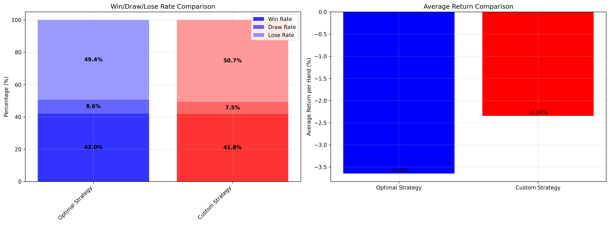
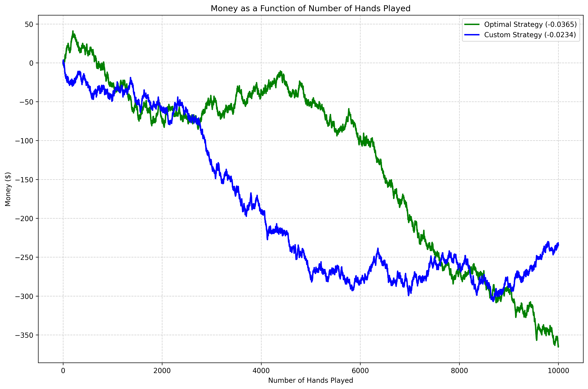
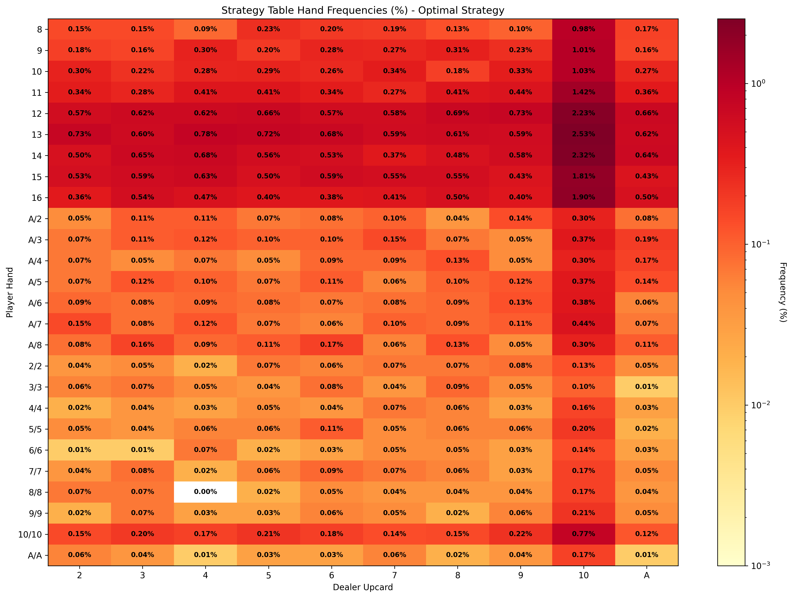

# 🎰 Blackjack Strategy Simulator

> A compact blackjack simulator focused on one question: which strategy loses the least money per hand under the rules used at the table?

## 🎯 Goal

The project runs thousands of blackjack hands and compares strategies by **average return per hand**. The point is not to beat the house, but to see which play style leaks money more slowly.

## 💰 Money-First Result

| Strategy | Avg return / hand | Total money | ROI |
|---|---:|---:|---:|
| 🟩 **Custom** | **-$0.0234** | **-$234.50** | **-2.28%** |
| 🟦 **Optimal** | -$0.0365 | -$364.50 | -3.55% |
| 🟨 **Naive** | — | — | Baseline only |

<em>Naive is kept as a reference strategy; the measured money comparison in this report focuses on the two table-based strategies.</em>

<figure>
	
	<figcaption><strong>Money-focused comparison.</strong> This chart puts the two measured tables side by side and makes the gap visible immediately: the custom table loses less money per hand than the generic online table.</figcaption>
</figure>

## 🧠 Strategy Snapshot

| Strategy | Decision style | Rule fit | Why it matters |
|---|---|---|---|
| 🟩 **Custom** | Internet basic strategy, lightly adjusted | Best match to the casino rules used here | Best average return in this report |
| 🟦 **Optimal** | Standard online basic strategy | Strong generic baseline | Very close, but slightly worse here |
| 🟨 **Naive** | Hit under 17, stand otherwise | Pure baseline | Shows how costly simple play becomes |

## 🔍 Why Custom Beats Generic Online Tables Here

Online basic-strategy charts are usually built for standard rules. Small rule differences can change the best move in close spots.

| Rule difference | Why it matters |
|---|---|
| Surrender allowed | Changes the best move on weak hard totals like 15 or 16 |
| Dealer hits soft 17 | Moves some hit/stand thresholds |
| Double restrictions | Removes profitable doubles in borderline hands |
| Split restrictions | Reduces pair-splitting value |
| Deck count | Changes hand frequencies and house edge |

## 📈 Visual Analysis

<figure>
	
	<figcaption><strong>Bankroll over time.</strong> The curve shows how the bankroll evolves hand by hand. A gentler slope means slower loss; a steeper drop means the house edge is showing up faster.</figcaption>
</figure>

<figure>
	
	<figcaption><strong>Hand-frequency heatmap.</strong> This is the most useful heatmap to keep: it highlights which hand / dealer-upcard situations happen most often, so the strategy is judged where it actually matters.</figcaption>
</figure>

## ✅ Key Takeaways

- The custom strategy is the best performer in this simulation.
- The online optimal table is strong, but not perfectly matched to these rules.
- Naive play is only a baseline and loses much faster.
- The important metric is average return per hand, not win ratio.

## 🧩 Project Files

- `blackjack_simulation.py`: simulation runner and report generation
- `blackjack_simulator.py`: single-run simulator and statistics collector
- `strategy_table.py`: strategy definitions and table logic
- `results.json`: summary metrics for the measured strategies
- `*.png`: generated visualizations used in this README

